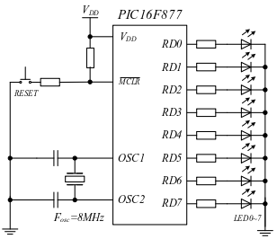

转载自 (https://www.jingyanjun.cn/sign/#/pic)
仅供考试使用
FH
2021/9/9

---

# 单片机原理及其应用

## 思考题

---

### 进制与编码

将二进制数`1011011.1`转换为十六进制数为`5B.8H`。
将二进制数`101101.101`转换为十进制数为`45.625D`。
二进制数`111101.001B`转换为十进制数是`61.125D`。
将十进制数`199`转换为二进制数为`11000111B`。
十进制数`36.875`转换成二进制是`100100.111B`。
带符号数在机器中以补码表示，`-78`表示为`FFB2H`。
补码`10110110`代表的十进制负数是`-74D`。
采用8位二进制数，整数补码所能表示的范围为`-128–127`，`-1`的补码是`0FFH`
一有符号数的补码为`11110111B`，它所表示的真值为`-9D`。
8位二进制数能表示的无符号十进制数的范围是0~255。
`111100B`除以`1100B`的结果是`101B`。
`11011010B`和`10110110B`“或”运算的结果是`11111110B`。

---

### PIC基本结构

#### 简答题

-  PICF16F877单片机内部功能模块
输入/输出端口，定时器/计数器，串行通讯，CCP捕捉/比较/PWM，A/D。

- 为什么PIC16F87X系列单片机的程序总线的宽度需要13位？
由于PIC16F877的程序存储器的容量是8K，因此需要13位的地址总线。

- 堆栈的宽度是多少，为什么？
堆栈的宽度是13位。 堆栈的宽度必须和程序计数器PC的宽度保持一直，PC的宽度是13位。

- 状态寄存器STATUS的标志位C和DC分别代表什么含义？ 分别在什么情况下被置1或清0。
    1. 标志位C代表：进位/借位标志位。
    执行加法指令时：1＝发生进位；0＝不发生进位。
    执行减法指令时：1＝不发生借位；0＝发生借位。
    1. 标志位DC代表：辅助进位/借位标志位。
    执行加法指令时：1＝低4位向高4位发生进位；0＝低4位向高4位不发生进位。
    执行减法指令时：1＝低4位向高4位不发生借位；0＝低4位向高4位发生借位。

- PIC16F87X系列单片机堆栈的深度和宽度分别是多少，其堆栈采用何种方式？如何操作？
深度为8层。
宽度为13位。
采用硬件堆栈的方式。
不需要进栈和出栈之类的堆栈操作专用指令，只有当执行调用指令或者CPU响应中断而发生跳转时，才把当前程序计数器PC值自动压入堆栈，当执行返回指令时，从堆栈中自动弹出并恢复程序计数器PC的原值。

- 时钟振荡电路的作用是什么？PIC系列单片机的时钟电路有哪几种工作模式？
时钟振荡电路为整个单片机芯片的工作提供系统时钟信号，也为单片机与其它外接芯片之间的通信提供可靠的同步时钟信号。
4种工作模式：标准XT，高速HS，低频LP和阻容RC。

- PIC16F87X系列单片机的程序总线和数据总线的宽度分别是多少位？分别起什么作用？
程序总线14位宽。专门实现从程序存储器到指令存储器快速及时地输送每一条指令。
数据总线8位宽。将各个外围模块以及核心部分的PC、FSR、W、ALU、RAM等功能部件联系起来。

---

### PIC单片机存储器

PIC16F877单片机内部的数据总线是8位， 程序计数器提供13条地址线， 内部配置了8Kx14位的Flash程序存储器。
PIC16F87X系列单片机的程序总线宽度为14位，数据总线的宽度为8位。
PIC16F87X系列单片机堆栈的深度为8级，宽度为13位。
PIC16F877单片机的中断服务程序入口地址统一设置在`004H`中。 退出中断服务程序时，返回地址来自于堆栈。

#### 简答题

- 什么叫中断矢量和复位矢量？在单片机运行过程中各起什么作用？
复位矢量就是主程序的入口地址，无论是由于初始加电还是由于其它原因引起的单片机复位，单片机都将从该地址入口开始执行主程序。
中断矢量就是中断服务子程序的入口地址，即无论单片机响应由于何种原因引起的中断请求，单片机都将从该地址进入中断服务子程序。

- 通用寄存器和特殊功能寄存器的主要差别是什么？
通用寄存器用于通用目的，即由用户自由安排和存放随机数据，单片机上电复位后其内容是不确定的。
特殊功能寄存器是用于专用目的的寄存器，每个寄存器单元甚至其中的每一位都有它自己固定的用途和名称。

- PIC16F87X系列单片机内的RAM存储器，在访问时为何存在体选问题？
在PIC16F87X系列单片机中，所有面向字节操作和面向位操作的指令，其指令代码中均包含一个7位长的数据存储器单元地址。
因为2^7＝128，所以在RAM存储器中最多可以区分128个存储器单元，而在RAM存储器中配置了512个单元，因此需要对整个的RAM存储器划分为4个体。

---

### PIC指令系统

PIC16F87X系列单片机的一个指令周期包含4个时钟周期。
在PIC单片机中每条指令一般都由操作码和操作数组成。
PIC16F87X系列单片机指令系统的寻址方式包括立即寻址，直接寻址，间接寻址和位寻址。
在PIC16F87X系列单片机中，对RAM进行间接寻址时，两位体选码来自于STATUS的IRP位和FSR的最高位。
PIC16F87X系列单片机指令的执行过程包含提取指令和执行指令两步。

#### 简答题

- 在PIC16F87X系列单片机中，是如何进行间接寻址操作的？
在采用间接寻址方式的指令码中，7位寄存器地址必为全0。利用7个0这个专用地址，特指FSR寄存器，并且以FSR寄存器内容为地址的RAM单元中存放着参加运算或操作的数据。

- 在直接寻址和间接寻址中，如何访问数据存储器？
主要借助于状态寄存器相关位的补充实现数据存储器的选择。
直接寻址：`7+2`
间接寻址：`8+1`

- 什么是指令周期和时钟周期？在PIC16F87X系列单片机中二者的关系是怎样的？
由时钟振荡电路产生的时钟信号所占有的时间称作时钟周期。
执行一条指令所需要的时间称作指令周期。
在PIC16F87X系列单片机中一个指令周期包含4个时钟周期。

- 为什么PIC16F87X系列单片机的一条指令平均占用一个指令周期？
PIC16F87X系列单片机的执行过程包含提取指令和执行指令两步；
内部采用哈佛总线结构，使得它在执行一条指令的同时，就可以提取下一条指令，从而实现流水作业，就使每一条指令的运行时间平均为一个指令周期。

- 已知工作寄存器W=`0F5H`，写出执行以下三条指令后的结果：
`ANDLW 0FH`；结果W=`05H`
`IORLW 0FH`；结果W=`0FFH`
`XORLW 0FH`；结果W=`0FAH`

- 在PIC16F87X系列单片机中，条件跳转指令分别为哪几条？其指令的执行时间，在什么条件下为1个指令周期？在什么条件下为2个指令周期？
4条条件跳转指令分别为：`DECFSZ`,`INCFSZ`,`BTFSC`,`BTFSS`。
当条件为真发生跳转时，需要占用2个指令周期，当条件为假不发生跳转时，占用1个指令周期。

- 如果要将某一RAM单元中的内容复制到另一个RAM单元中，应该使用什么指令实现？能否利用一条指令实现？
```assembly
MOVF F,W
MOVWF F
```
不能使用一条指令实现。

- 一条`MOVF 20H,F`指令被执行后，产生什么结果？有什么用处？
把文件寄存器的数据重新传入该文件寄存器本身。对Z标志位产生影响。
目的是判断该寄存器中的数据是否为0。

---

### PIC汇编程序设计

#### 简答题

- 汇编语言语句的构成分为哪几个字段？其中对于标号的命名有哪些规则要求？
汇编语言语句的构成由：标号，操作码，操作数，注释，四个部分组成。
标号的命名规则有：最多可以由32个字母、数字和其它一些字符组成，且第一个字符必须是字母或下划线，必须从一行的第一列开始写，后面用空格或换行符与操作码分开。系统保留字不能用于标号。

- 为什么在PIC16F87X系列单片机中存在跨页跳转问题？在PIC16F877中是怎样实现跨页跳转的？
    1. PIC16F87X的程序计数器为13位，可寻址范围为8K。但`GOTO`和`CALL`指令只能提供11位地址（寻址范围2K）。故对于大于2K地址空间的芯片进行了分页。当`GOTO`或`CALL`指令的地址范围超出2K范围时，就会出现跨页跳转和调用问题。
    1. 页地址在PCLATH寄存器的`PCLATH<4:3>`中，要实现跨页跳转或调用，首先修改`PCLATH<4:3>`位。

### I/O端口
RC高3位设为输入，低5位设为输出，TRISC的值为：`B'11100000'`。

#### 编程题

- 写出设置端口RD为输入，RC为输出且输出为全1的程序段。
```assembly
BSF   STATUS,RP0
MOVLW 0FFH
MOVWF TRISD
CLRF  TRISC
BCF   STATUS,RP0
MOVLW 0FFH
MOVWF PORTC
```

- 写出设置RD0～RD3为输入，RD4～RD7为输出，并使RD4～RD7输出`0101B`的程序段。
```assembly
BSF   STATUS, RP0
MOVLW 0FH
MOVWF TRISD
BCF   STATUS,RP0
MOVWF 50H
MOVWF PORTD
```

- 若使 [图7.1](./images/7.1.jpg "图7.1 硬件接线图") 中的LED0～LED7按 [图6.2](./images/6.2.jpg "图6.2 LED显示方式") 显示方式 方式循环显示（间隔为1秒），编写实现上述功能的程序。


```assembly
INCLUDE  "P16F877.INC"
COUNT   EQU    70H
        ORG    0000H
        NOP
        BSF    STATUS,RP0
        CLRF   TRISD
        BCF    STATUS,RP0
LOP2    CLRF   COUNT
LOP1    MOVF   COUNT,W
        CALL   TABLE
        MOVWF  PORTD
        CALL   DELAY1S
        INCF   COUNT,F
        BTFSS  COUNT,4
        GOTO   LOP1
        GOTO   LOP2
TABLE   ADDWF  PCL,1
        RETLW  B'00000001'
        RETLW  B'00000011'
        RETLW  B'00000111'
        RETLW  B'00001111'
        RETLW  B'00011111'
        RETLW  B'00111111'
        RETLW  B'01111111'
        RETLW  B'11111111'
        RETLW  B'11111110'
        RETLW  B'11111100'
        RETLW  B'11111000'
        RETLW  B'11110000'
        RETLW  B'11100000'
        RETLW  B'11000000'
        RETLW  B'10000000'
        RETLW  B'00000000'
        END
```

- 硬件电路如 [图6.3](.\images\6.3.jpg) 所示，用端口RD的8个管脚控制一只共阴极LED数码管，要求当按键SW1按下后，把寄存器22H中的低半字节作为一位十六进制送到LED显示。


---

### 定时器/计数器

#### 简答题

- 试述TMR0和TMR1的共同点和不同点
共同点：定时器/计数器
有预分频器
不同点：8位/16位
TMR1有特殊功能（CCP），带RTC。

- 看门狗定时器WDT的功能是什么？为什么能实现该功能？
单片机一旦发生程序失控或死机，看门狗会产生复位信号，使系统回到正常工作状态。
WDT依靠单片机内部自带的RC振荡器作为其时钟信号，实现对主程序的监控。

#### 编程题

- 要求RC口连接8个LED显示灯，作为自动加一计数器的显示窗口，间隔时间为0.5s，这里假定时钟振荡频率为4MHz。

```assembly
COUNTER EQU       20H
        ORG       0000H
MAIN    NOP
        BSF       STATUS,RP0
        MOVLW     00H
        MOVWF     TRISC
        MOVLW     07H
        MOVWF     OPTION_REG
        BCF       STATUS,RP0
        CLRF      PORTC
LOOP    MOVLW     0AH
        MOVWF     COUNTER
        INCF      PORTC
JX      CALL      DEL50MS
        DECFSZ    COUNTER
        GOTO      JX
        GOTO      LOOP

DEL50MS BCF       INTCON,T0IF
        MOVLW     03DH
        MOVWF     TMR0
LP1     BTFSS     INTCON,T0IF
        GOTO      LP1
        RETURN
        END
```

---

### 中断系统
从中断服务子程序返回的指令是`RETFIE`。

#### 简答题
- 对于PIC单片机来说，一次中断过程大致经历哪9个阶段，并简要说明。
一次中断所经历的阶段：中断请求、中断屏蔽、中断响应、保护现场、调查中断源、中断处理、清除标志、恢复现场、中断返回。

- 什么叫中断源？什么叫保护断点和恢复断点？
中断源就是引起中断的原因或根源，就是中断请求的来源。
保护断点：当发生中断后，如果CPU允许响应这次中断，CPU必须在现形的指令自行完毕后，把断点处的程序计数器PC值压入堆栈保存起来。
恢复断点：当中断处理完成后，在恢复程序计数器PC的值。

- 在中断服务程序中，为什么要保护现场和恢复现场？
在进入中断服务程序期间，CPU只将PC值自动压入堆栈。由于中断程序的运行可能会影响W、STATUS等寄存器的值。因此，进入中断后，首先要保护好这些寄存器的内容，待中断返回时，再将其恢复，以保证被中断的程序继续正确的运行。

- 什么叫保护现场？什么叫恢复现场？
发生中断后，把各个重要寄存器的内容和状态标志位保留起来称为保护现场。
当中断完成后，在恢复事先被保留下来的各个寄存器的内容和状态标志称为恢复现场。

#### 编程题
- 写出PIC单片机发生中断时，对W、STATUS和PCLATH进行现场保护与现场恢复的程序片段。
```assembly
MOVWF   W_TEMP         ；复制W到备份寄存器W_TEMP中
SWAPF   STATUS,W       ；将STATUS高低半字节交换后放入W
MOVWF   STATUS_TEMP    ；保存STATUS保存到STATUS_TEMP
MOVF    PCLATH,W       ；把寄存器PCLATH内容复制到W中
MOVWF   PCLATH_TEMP    ；将PCLATH保存到PCLATH_TEMP
……                     ；（中断服务子程序处理部分）
MOVF    PCLATH_TEMP,W  ；经过W转移
MOVWF   PCLATH         ；恢复PCLATH内容
SWAPF   STATUS_TEMP,W  ；高低半字节交换后放人W
MOVWF   STATUS         ；把W内容移动到STATUS寄存器
SWAPF   W_TEMP,F       ；W_TEMP高低半字节交换放回
SWAPF   W_TEMP,W       ；W_TEMP高低半字节交换放入W
```

---

### 串行通讯

#### 简答题
- 什么叫单工、半双工、全双工通讯方式？
单工：一方只能发送信息，而另一方只能接收信息。
半双工：双方都能发送和接收信息。但是在某一时刻，A方只能发送信息，B方只能接收信息；而在另一时刻，B方只能发送信息，A方只能接收信息。
全双工：在同一时刻，A、B双方既能发送信息也能接收信息。
- 串行通讯中存在着哪两种基本通讯方式，并简要说明。
串行通讯的两种通讯方式是：异步传送和同步传送。
异步传送：收发双方使用自己的时钟源。
同步传送：收发双方有时钟传输线。

---

### CCP模块

#### 简答题
- CCP模块各工作方式分别需要哪些定时器支持？
捕捉：TMR1
比较：TMR1
脉宽调制：TMR2

---

### A/D转换器
PIC16F877单片机配置的10位A/D转换器，就其工作原理来讲， 采用了逐次比较工作方式。

#### 简答题
- 如何提高A/D转换的精度？
一是降低参考电压Vref+和Vref-的差值；
二是在睡眠模式下进行A/D转换

- 能否通过压缩正、负参考电压之间的差值来提高ADC的转换精度？
可以通过压缩正、负参考电压之间的差值来提高ADC转换的分辨率，但只是在一定范围内才可以。

- 在什么情况下需要为ADC模块外接参考电压源？
在单片机的电源电压不太稳定时，或需要压缩正、负参考电压来提高转换分辨率时可以采用外接参考电压源。（或为了提高转换精度和分辨率时可以采用外接参考电源）。

#### 编程题
使用ADC模块以中断的方式进行A/D转换，分别写出对寄存器INTCON，PIR1和PIE1初始化的设置程序。
```assembly
MOVLW   0C0H
MOVWF   INTCON
MOVLW   00H
MOVWF   PIR1
BSF     STATUS,RP0
MOVLW   40H
MOVWF   PIE1
BCF     STATUS,RP0
```